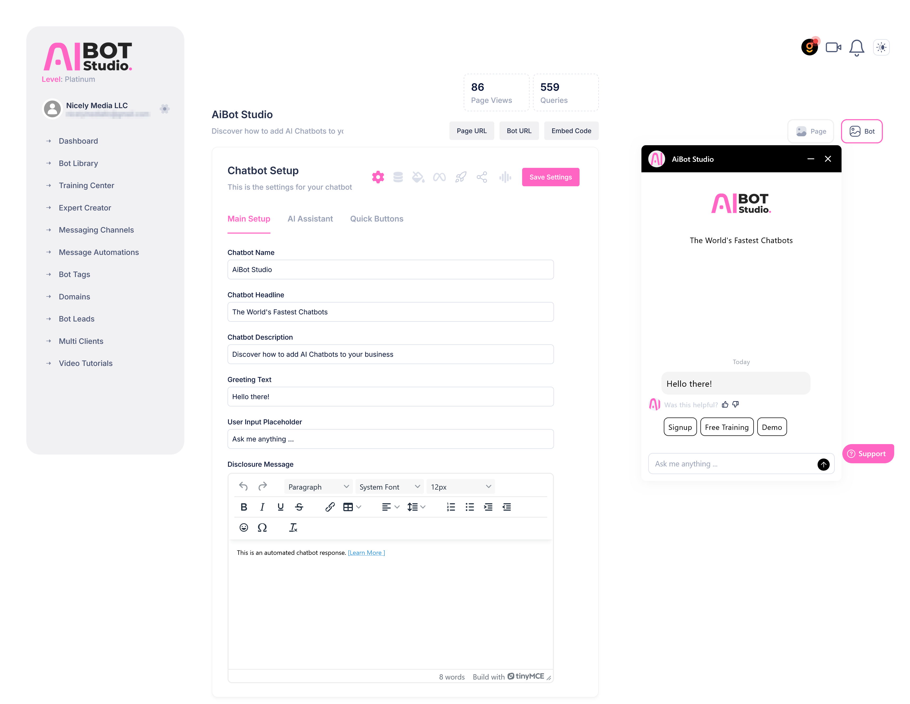
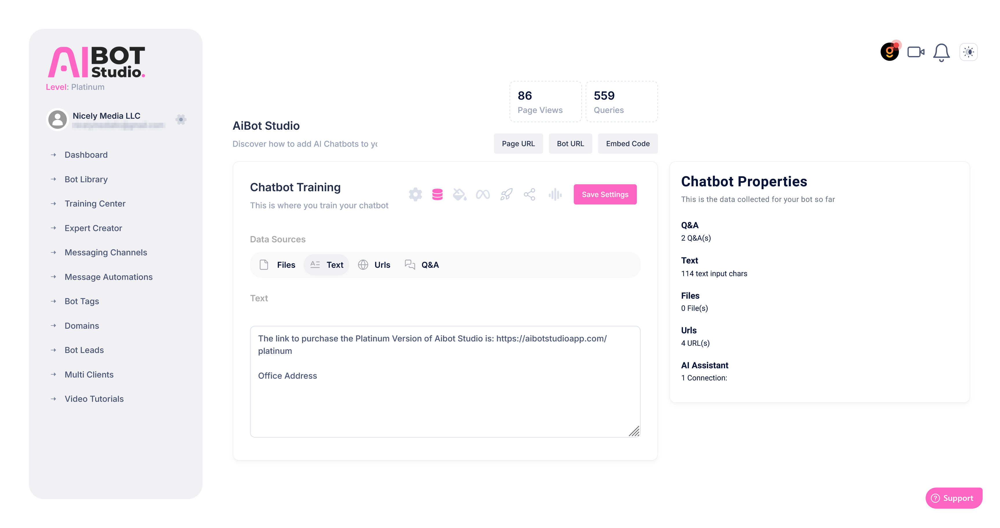
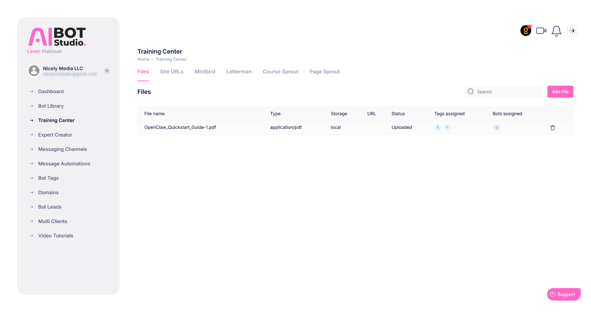
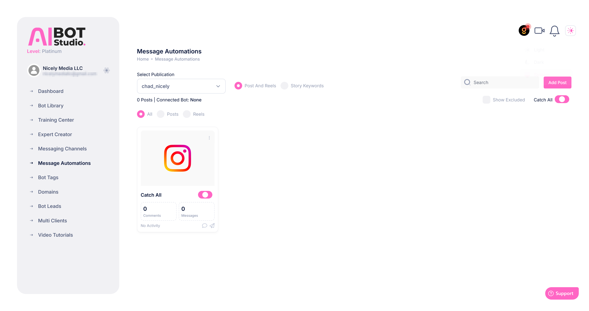
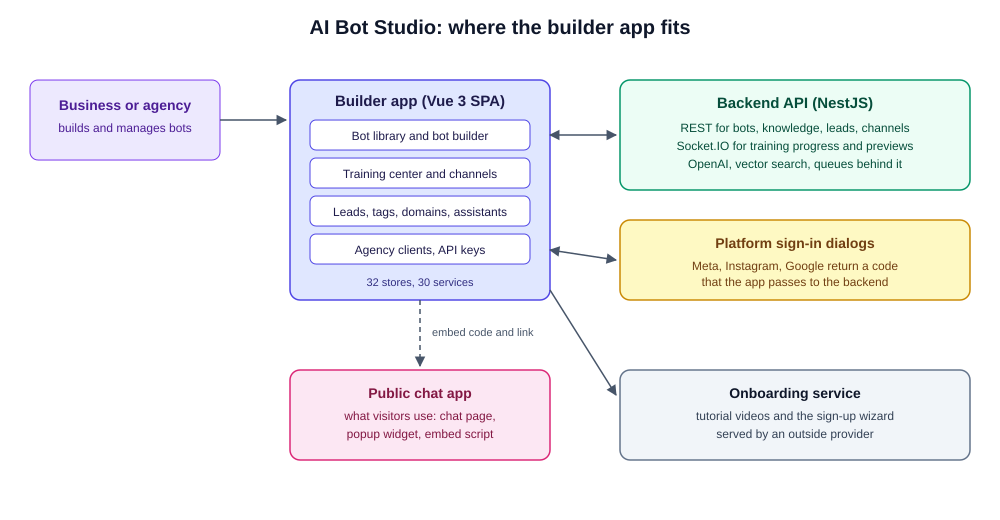
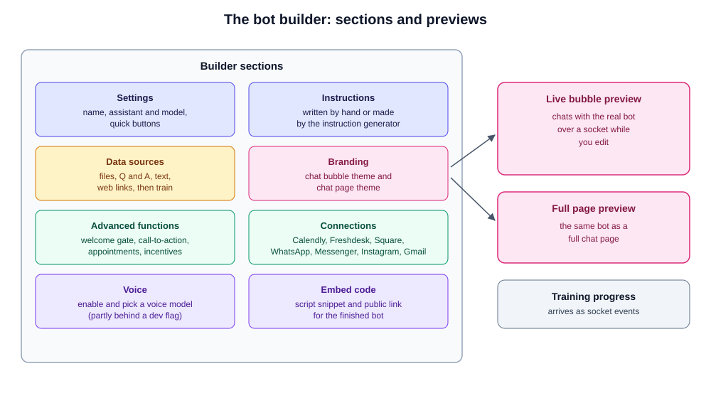

# AI Bot Studio Frontend

Documentation for the customer app of AI Bot Studio, a platform for building AI chat bots that answer from a business's own content. This is the builder: where a user creates a bot, gives it knowledge, styles it, connects channels and reviews leads. It talks to [AI-Bot-Studio-Backend](https://github.com/jsoftsol/AI-Bot-Studio-Backend), and the bots it builds run for visitors in [AI-Bot-Studio-Public](https://github.com/jsoftsol/AI-Bot-Studio-Public).

> **The source code is not included in this repository.** This is client work and the code is proprietary. This repo only holds documentation: this README, a reverse-engineered product spec ([PRD.md](PRD.md)), and screenshots and two diagrams in `screenshots/`. Everything here was written from a read-through of the actual codebase. Hostnames, credentials and security specifics are left out on purpose.

## Screenshots

Taken from a working account. The account email is pixelated.

**Bot builder.** Main setup on the left and the live chat bubble preview on the right, with the page view and query counts for the bot.


**Data sources.** Tabs for files, text, URLs and question and answer pairs, with a summary of what the bot has been given so far.


**Training center.** Uploaded files with their type, storage, status and the tags and bots they are linked to. Other tabs cover site URLs and connected platforms.


**Message automations.** The posts and reels of a connected Instagram account, a catch-all switch, and comment and message counts.


## What it does

A user signs in, creates a bot and walks through its settings: instructions, knowledge sources, branding, extra functions and channels. A live preview shows the chat bubble and the full chat page while they edit. Training runs on the server and its progress comes back over a socket. When the bot is ready, the app gives an embed code and a public link, and later shows the conversations, leads and tags that come in. Agencies can switch into a client's account and work there.

## Architecture



```
User -> Vue 3 SPA -> Pinia stores -> API services (Axios) -> AI Bot Studio backend
                          |
                          +-> Socket.IO (training progress, notifications, preview chat)
```

- A single-page Vue 3 app with one authenticated layout and a small public layout for sign-in and legal pages.
- About 348 Vue files, 32 Pinia stores and 30 service files.
- One Axios wrapper adds the bearer token, and an extra header when an agency is working inside a client account.
- One Socket.IO connection starts at app load and restarts after sign-in or an agency switch. Rooms are used for per-user and per-conversation events.
- The base is the Metronic admin template, with Bootstrap 5 and Element Plus. Much of the template's demo code is still in the repo but is not routed.
- Deployment is a manual build and copy to the web server. A second build mode produces a white-label variant of the app.

### The bot builder



## Tech stack

| Area | Tools |
|---|---|
| Framework | Vue 3, Vue Router 4, Pinia, vue-i18n |
| Language and build | TypeScript 5, Vite 4, vue-tsc |
| UI | Metronic template, Bootstrap 5, Element Plus, a Tailwind starter |
| HTTP and realtime | Axios, Socket.IO client |
| Charts and maps | amCharts 5 (world map), ApexCharts (bar charts) |
| Editors | TinyMCE, Quill, Prism for code display |
| Forms | vee-validate, Yup |
| Other | FullCalendar, SweetAlert2 and Toastify toasts, Dropzone uploads |

## Core features

- **Dashboard.** Stats with bar charts and a world map of conversations.
- **Bot library.** List, create, clone (choosing what to copy), group, tag and assign a custom domain and URL slug.
- **Bot builder.** Settings and quick buttons, assistant and model choice, instructions with an instruction generator, four knowledge sources (files, Q and A, text, web links), branding for the chat bubble and the chat page, a welcome gate that collects lead details, call-to-action, recommendations, appointment and incentive options, and the embed code.
- **Live previews.** A chat bubble preview that talks to the real bot over a socket, and a full-page preview.
- **Training center.** Crawl websites with summaries, upload and tag files, see which bots use them, and pull content from connected platforms.
- **Channels.** Connect WhatsApp Business, Facebook Messenger, Instagram and Gmail through each platform's sign-in flow, and Freshdesk by account. Calendly and Square connect per bot.
- **Message automations.** Instagram and Messenger comment and message rules, with keywords, posts, templates and a catch-all switch.
- **Voice.** A setting to turn on a voice bot and pick a voice model, partly hidden behind a development flag.
- **Assistants.** A library plus an expert creator that generates instructions.
- **Leads, tags and conversations.** Simple management pages.
- **API keys.** Store OpenAI keys and view the user's own API token.
- **Custom domains.** Map a domain to a bot with a URL path slug.
- **Agency clients.** Add clients, upload a profile image and log in as a client.
- **Onboarding.** Video tutorials and a sign-up wizard served by an outside onboarding service.

## Known limitations

- **No billing or subscription screens.** The demo pages from the template for subscriptions and customers are not wired up.
- **Some features are hidden or unfinished.** The voice tabs for main setup and scripts and a goal selector sit behind a development flag, and the goal selector has no options. Two-factor screens are template demos.
- **Large amount of dead template code.** A large number of unused demo pages, widgets and styles, and a tracked folder holding a second template. About a third of the tracked files are template assets.
- **Duplicate routes.** Two paths share one view in a couple of places, and a second library route tree conflicts with the first.
- **No role-based screens.** Access level only filters the sidebar.
- **Hardcoded hosts** in the OAuth flows for Gmail, Instagram and Messenger, so those flows only work against specific environments.
- **A backup file and an unused service** are tracked, and the register route is commented out.
- **Heavy bundle.** Two chart libraries, two editors, FullCalendar and all of Element Plus are loaded, and the build warning limit is raised to silence the size warning.
- **No tests.** Lint and format settings exist but nothing runs them automatically.
- **Environment files are tracked in git.** They should be untracked and kept out of history.
- **A build script for the white-label variant calls the wrong target.**

## Author

Ammad Sarfraz

This repository contains documentation only. The AI Bot Studio platform and its source code belong to the client.
